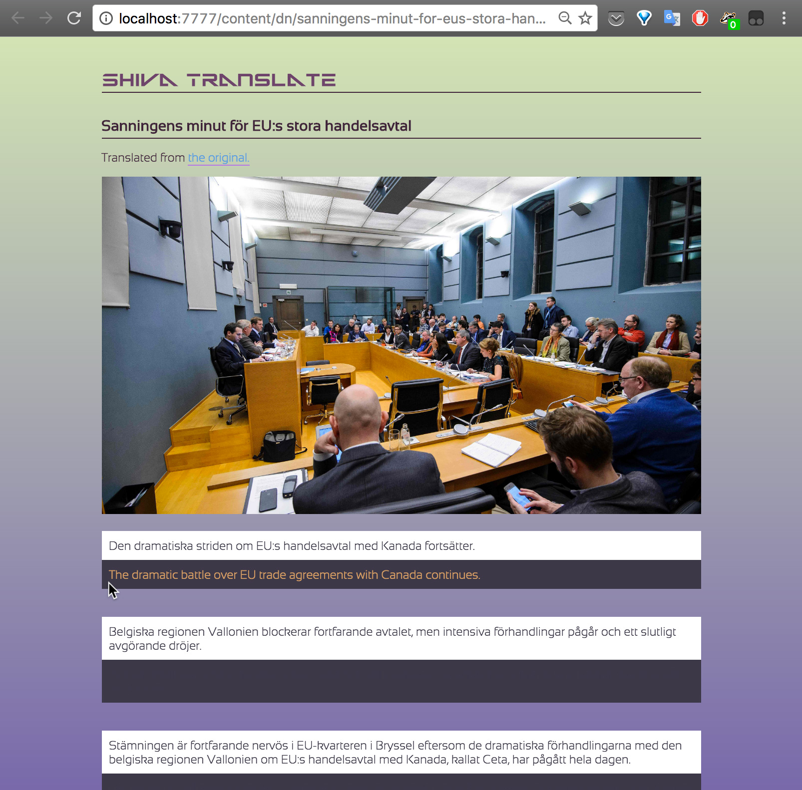

shiva
=========

A program to practice reading foreign language (Swedish) news, with native translations easily available via hovering. It's structured as a scotty web app which can be run locally.

Invoked without command line options, the executable starts the web server and opens a browser window pointed to the appropriate addresses.

The main page links to a list of RSS feeds corresponding to different news categories. When any item in a feed listing is clicked on, it opens a page displaying the article text, separated by sentence, together with a div containing the native-language translation but whose text is only visible when the cursor hovers over it.

### Preview

An article page will look something like this.

### Usage

##### Installation

It is recommended to install with Stack.

This package needs [my branch](https://github.com/BlackBrane/Microsoft-Translator-Haskell) of the MicrosoftTranslator package, and using Stack is the the easiest way to ensure that this correct version of that dependency is used.

##### API access

Translation is performed via the Microsoft Translator API, which is free for up to 2M characters per month.

In order to use this program, you'll need to [register an "application" to use the service with a Microsoft account](https://www.microsoft.com/en-us/translator/getstarted.aspx).

Once the package is installed run `shiva setup` to enter your MS account and database information.

### Other languages and news sources

At present, I've only supported a few RSS feeds from the Swedish newspaper _Dagens Nyheter_. The idea is to make it easy to plug in other sources in Haskell code by importing the library, but right now this still requires editing the package source code. However this should be pretty easy. Just look at `Sources.hs` mostly.

### Future work

I also intend to hook this up to the Reddit API.
